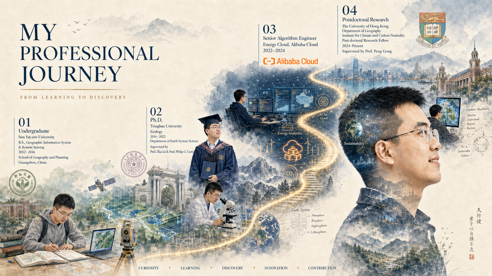

### 💼 WORKING EXPERIENCE
- **Post-doctoral Research Fellow**, 2024-present  
Department of Geography, Institute for Climate and Carbon Neutrality, The University of Hong Kong, Hong Kong SAR, China  
Supervised by *[Prof. Peng Gong](https://www.geog.hku.hk/p-gong)*
- **Senior Algorithm Engineer**, Energy Cloud, 2022-2024  
Alibaba Cloud, Hangzhou, China  

### 🎓 EDUCATIONS
- **Ph.D.**, Ecology, 2016-2022  
Department of Earth System Science, Tsinghua University, Beijing, China  
Supervised by *[Prof. Zhu Liu](https://scholar.harvard.edu/zhu/home)* & *[Prof. Philippe Ciais](https://www.lsce.ipsl.fr/en/cycles-transferts/biogeo/pisp/philippe-ciais/)*
- **B.S.**, Geographic Information System & Remote Sensing, 2012-2016  
School of Geography and Planning, Sun Yat-sen University, Guangzhou, China

### 🎖 HONORS AND AWARDS
- RGC Postdoctoral Fellowship Scheme 2024/25 (港府博士后奖学金计划, HKD1,260,000), [2024](https://www.ugc.edu.hk/doc/eng/rgc/pdfs/PDFS_awardees2425.pdf)
- Outstanding graduates of Beijing (北京市优秀毕业生, Top 5%), 2022
- Jiang Nanxiang Scholarship (蒋南翔奖学金, Top 1%), [2021](https://www.tsinghua.org.cn/__local/2/74/14/E84F843C50DDD57A4F232042A94_B6BAC347_C1EBE.pdf)
- National Scholarship (国家奖学金, Top 1%), 2020

### 💬 INVITED TALKS
- IPCC Expert Meeting on Reconciling Land Use Change Emissions, Ispra, Italy, 2024
- Global Youth Summit on Net-Zero Future, Beijing, China, 2021
- 2021 Sino-American Youth Dialogue, Beijing, China, 2021
- ESA-CCI RECCAP2 progress meeting, Virtual meeting, 2021